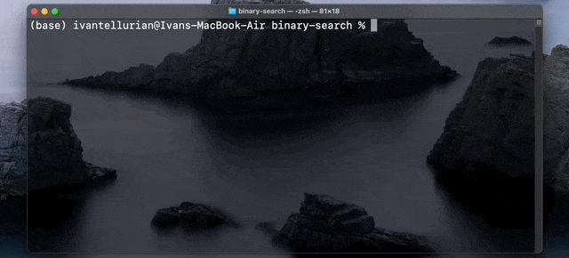

# Binary Search

An app to play around with a binary search algorithm. It's implemented in Python and it works inside a terminal/command prompt.



## Run It:

To run this stupid little program you should open the terminal at the same directory as your sigmoid.py program, and then type:

```
python binary_search.py
```

### What is a Binary Search Algorithm?
It's a mathematical function that maps map the values on the X exis into a small range of values between 0 and 1 on the Y axis. It looks like an S-shaped curve.

### Why is Binary Search useful?
- One of the coolest use cases of a sigmoid function is Deep Learning. It's used as an activation function in an artificial neural network. They were inspired by the activation potential in biological neural networks.

- Sigmoid functions are also useful for many machine learning applications where a real number needs to be converted to a probability. A sigmoid function placed as the last layer of a machine learning model can serve to convert the model's output into a probability score, which can be easier to work with and interpret.

- Sigmoid functions are an important part of a logistic regression model. Logistic regression is a modification of linear regression for two-class classification, and converts one or more real-valued inputs into a probability, such as the probability that a customer will purchase a product. The final stage of a logistic regression model is often set to the logistic function, which allows the model to output a probability.


